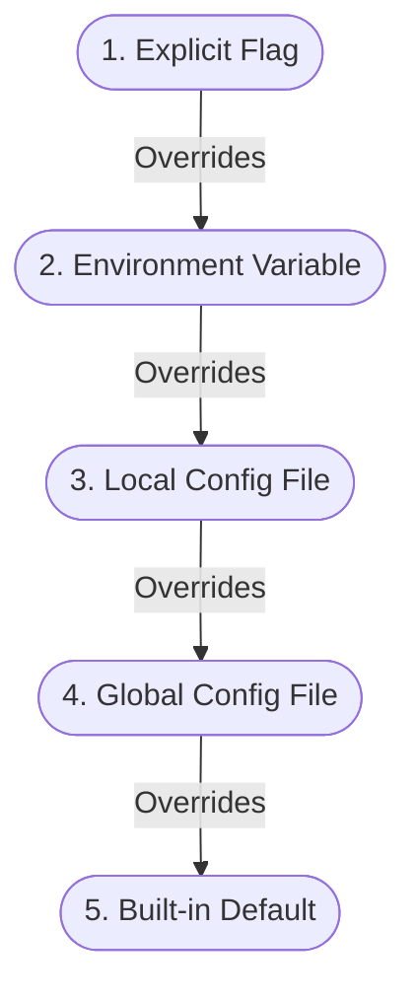
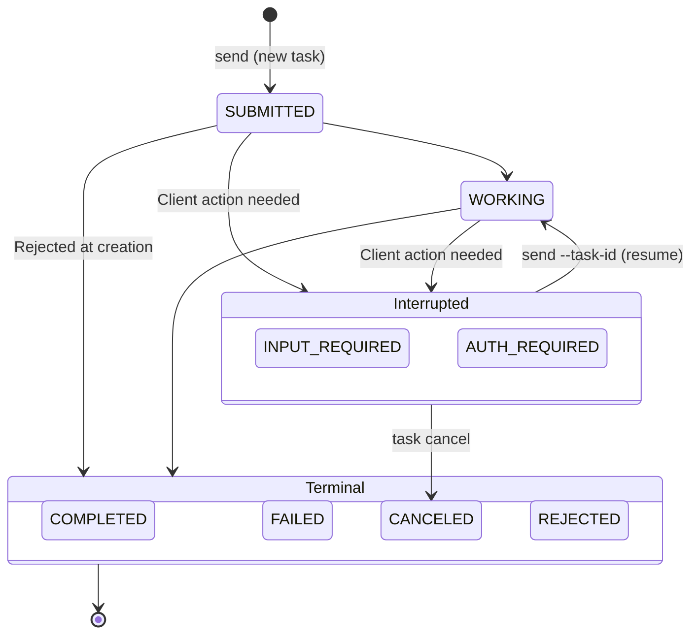
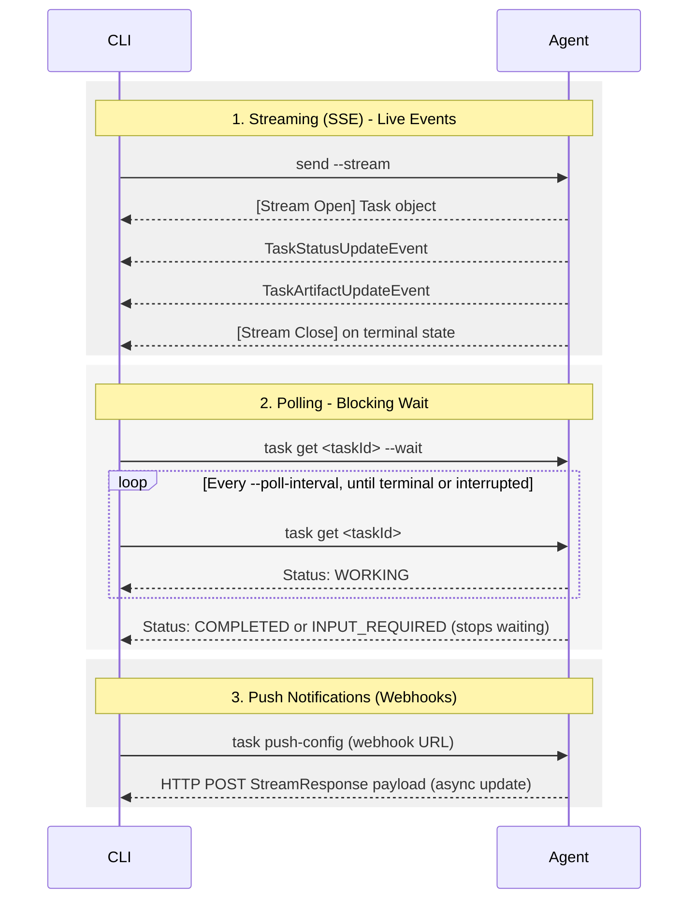

# a2a-cli Specification

**Version:** 0.2
**Status:** Review — a pre-Proposed state (§15.1).
**Last updated:** 2026-08-17
**Applies to:** A2A Protocol v1.0 — built against [A2A v1.0.0](https://a2a-protocol.org/v1.0.0/specification/) as its baseline.
**Verification:** `COMPLIANCE.md`

## Abstract

This document specifies **`a2a-cli`**: the command-line client for the [Agent2Agent (A2A) Protocol](https://a2a-protocol.org/latest/specification/). It defines the tool's command surface, output contract, and interaction model — how an `a2a-cli` behaves — in terms an implementation in any language can follow.

It is self-contained: everything needed to build the tool is here. How an implementation *demonstrates* that it meets this specification — the requirement identifiers, the evidence rules, and the report format — is defined separately in `COMPLIANCE.md`.

This is an **implementer's specification**. Its audience is engineers building or improving an `a2a-cli`. It constrains CLI behavior only and never modifies A2A wire semantics.

> **Naming.** For ease of reference, this document refers to the tool as `a2a-cli` throughout.

## Notational conventions

The key words **MUST**, **MUST NOT**, **REQUIRED**, **SHALL**, **SHALL NOT**, **SHOULD**, **SHOULD NOT**, **RECOMMENDED**, **MAY**, and **OPTIONAL** are to be interpreted as described in [RFC 2119](https://www.rfc-editor.org/rfc/rfc2119).

References of the form "A2A §x" point to the A2A Protocol Specification v1.0. Where an A2A rule is load-bearing for the CLI it is restated here so this document is self-contained; the A2A specification remains authoritative for protocol semantics.

---

## 1. Problem statement

A2A has a stable protocol and a growing set of agents. What it does not yet have is one agreed way to talk to them from a command line.

**Eleven CLIs already exist, and they rebuild the same five commands.** Across six languages, every one of them sends a message and fetches an Agent Card, ten stream, nine read task status, nine cancel — and only four list tasks, only three configure push notifications ([A2A#1929](https://github.com/a2aproject/A2A/issues/1929#issuecomment-5326727779)). Practice has settled the common path; the harder half of the protocol is unbuilt in nearly all of them. This document writes down what implementers already converged on rather than inventing a design, and names the surface that fragmentation has left unfinished.

**A2A's developer-tooling layer is still forming, and a command line is the shortest way in.** The protocol reached a stable [v1.0](https://github.com/a2aproject/A2A/releases) in March 2026, and support has kept growing — from more than 100 organisations at the Linux Foundation launch to [169 listed today](https://a2a-protocol.org/latest/partners/), with the Python SDK alone pulling over 16 million downloads a month. That growth has landed mainly in agent frameworks and enterprise platforms: among coding harnesses, adoption is nearly nonexistent — one or two document A2A support today, and where it exists, it is labeled experimental. A single specified CLI, shipped with one skill descriptor, offers both audiences the same low-friction entry point: a developer can exercise a deployed agent in one command, and a coding agent can drive that same command from its [skill file](https://agentskills.io/skill-creation/using-scripts.md).

<!-- **Nothing on the client side is verifiable.** The [Technology Compatibility Kit](https://github.com/a2aproject/a2a-tck) validates agents, not clients — its own documentation states it "validates A2A-protocol-compliant agents" — and the [Inspector](https://github.com/a2aproject/a2a-inspector) is a browser application with no headless or CI path. A developer can prove their *agent* conforms to the protocol. There is no equivalent way to show that a *client* does. -->

This specification writes that common path down once — the core client behavior every implementation can share — so a caller gets the same experience whichever tool they reach for. Anything more specialised builds on top of it (Appendix E, experimental).

---

## 2. Goals

An `a2a-cli` is an **A2A client**: a unified command-line tool that lets human developers, automated workflows, and AI coding harnesses send tasks, stream updates, and fetch artifacts from any A2A-supported agent instance. This specification sets out four core goals to resolve the fragmentation, tooling gaps, and lack of standard guidance described in §1. They state the outcomes this specification achieves, not the operative rules (which are defined in §6–§14):

2.1 **Deliver complete protocol coverage and multi-transport support.** Go beyond the fragmented basic commands (`card get`, `send`) that ad-hoc tools re-invented, and specify the full breadth of the A2A Protocol. An `a2a-cli` covers all A2A transport bindings (JSON-RPC, HTTP+JSON, and gRPC), lifecycle event streaming and polling, push notifications, and enterprise security across cumulative capability tiers (§5), for a unified, predictable command surface across languages.

2.2 **Maximize developer convenience, learnability, and ergonomics.** Make discovering, learning, and driving the tool effortless from day one. The CLI provides opinionated, sensible defaults — such as blocking waits on task completion, automatic server-preference transport negotiation, and well-known card resolution — that minimize boilerplate flags while keeping every behavior overridable (§6.5) and discoverable via built-in `--help`.

2.3 **Built for the AI era: seamless for both human developers and AI coding agents.** As AI coding agents, autonomous agentic harnesses, and human-in-the-loop workflows proliferate, the CLI serves humans and AI agents as first-class peers (§6.1). It provides a human-friendly, pipe-safe `text` format for interactive terminal use, protocol-native `json`/JSONL streaming for automated consumption (§11.3), and ships with a lean, standardized Agent Skill descriptor (`SKILL.md`, §14) so coding harnesses can delegate tasks to A2A instances with zero friction.

2.4 **Serve as a definitive implementation guide and capability roadmap.** Provide an authoritative, language-agnostic blueprint that guides engineers building or enhancing an `a2a-cli`. Through a structured, cumulative capability roadmap (Tier 1 Core, Tier 2 Standard, Tier 3 Advanced; §5) paired with a companion verification checklist (`COMPLIANCE.md`), it gives implementers a clear path for what to build first, next, and later, while making it straightforward to measure and demonstrate progress.

---

## 3. Non-goals

This specification does not:

- **define server or agent behavior** — an `a2a-cli` is a client; acting *as* a server (publishing an Agent Card, minting server-side identifiers, serving inbound requests) is outside the client baseline, and `demo-server` mode is Tier 3 (§7.1);
- **alter A2A wire semantics**; or
- **mandate an implementation language or framework**.

---

## 4. Object model

Restated from A2A §4 so this document stands alone:

- **Message** — a single turn. Has a `role` (`user` or `agent`) and one or more **Parts** (`text`, `file`, or `data`). Carries a client-assigned **`messageId`**.
- **Task** — the stateful unit of work a message may create. Identified by a server-assigned **`taskId`**; advances through a **TaskState** (§9.1); may emit **Artifacts**.
- **Artifact** — a task output (text, structured data, or file). Task outputs are delivered as Artifacts, not Messages; an `a2a-cli` MUST render Artifacts.
- **`contextId`** — a server-assigned, opaque identifier that groups related tasks and messages. A2A does not define what the grouping *means*; that is the agent author's decision, and an `a2a-cli` MUST NOT assume it denotes a chat session.
- **AgentCard** — the server's machine-readable description of identity, capabilities, interfaces (transports), security schemes, and skills, obtained by resolving an Agent Card reference (§10.1).

### 4.1 Identifiers

| Identifier | Assigned by | Role | Constraints |
| --- | --- | --- | --- |
| `messageId` | Client | Turn identity / idempotency | SHOULD be reused when retrying a turn: Send is not guaranteed idempotent (A2A §3.3.1 makes idempotency OPTIONAL), so reuse MAY avoid duplicated work with agents that deduplicate on `messageId`. |
| `taskId` | Server | Unit of work | A tool MUST NOT invent a `taskId` for a new task. A client-supplied `taskId` MUST reference an existing task; otherwise the server returns a not-found error. |
| `contextId` | Server | Context grouping | Opaque; a tool SHOULD NOT fabricate one. A `contextId` and `taskId` that do not correspond MUST be rejected by the server; a tool MUST NOT attempt to reconcile them. |

An `a2a-cli` never *creates* server identifiers. It reports the ones the server assigned (§8.2) and accepts them back as explicit input (§8.1); it MUST NOT store them and replay them on the caller's behalf.

---

## 5. Capability tiers

This specification groups its requirements into three **cumulative** tiers. A tier describes *scope* — what an `a2a-cli` does first, next, and later — and is a property of the requirement, not a rank awarded to an implementation. Tier 2 includes everything in Tier 1; Tier 3 includes everything in Tier 2.

| Tier | Name | Requirements |
| --- | --- | --- |
| **Tier 1** | Core | §6.5 default behavior · §8 interaction/session handling · §9 polling · §10.1–10.4 commands (`card get`, `send`, `task get`, `task cancel`) · `help` and `--version` (§7.1, §7.2) · §11 output & exit codes · §12.1 auth · §13 transport & versioning · §14 SKILL.md (conditional — applies only if the tool ships a skill, §14.1) |
| **Tier 2** | Standard | Tier 1 + `task list`, `task subscribe`, OAuth `auth login`, ≥2 transports, configuration scoping, `task push-config` CRUD, `task download`, wire debug, `conformance`, `completion` |
| **Tier 3** | Advanced | Tier 2 + a push-notification webhook receiver, interactive `chat`, gRPC transport, authenticated extended Agent Card, Agent Card signature verification, mTLS, OpenID Connect, `demo-server`/mock mode, catalog/registry, protocol extensions |

Tier membership is stated here because it is a scope decision: it determines what belongs in the baseline tool and what is deferred. Everything about *claiming* a tier — the requirement identifiers, what counts as satisfying one, and the evidence a claim needs — is defined in `COMPLIANCE.md`.

---

## 6. Design principles

Six principles the rest of this document implements. They are normative where they use RFC 2119 keywords; §7–§14 carry the operative rules, and a principle is a statement of shape, not a second place to look up a requirement.

6.1 **Dual-consumer, agent-first core.** An `a2a-cli` is driven by two kinds of consumer at once — a person at a terminal, and a program: a shell script, a CI job, or an AI coding agent. Neither is second-class. `text` and `json` are peer formats, each with its own contract (§11.2, §11.3): `text` is the default and MUST stay parseable and pipe-safe, `json` carries the protocol's own types for a program to consume. **Where the two pull apart, the programmatic consumer sets the default** — hence *agent-first*: no interactive prompts, no terminal control sequences, and output whose shape does not vary with the environment it runs in. An interactive mode (for example `chat`, Tier 3) MUST be gated by terminal detection and MUST NOT be the default. *Why: Human affordances are added on top of the machine contract, never carved out of it. A tool that prompts, colorizes, or reshapes its output when it detects a terminal has two behaviors to test and one of them is invisible to CI.*

6.2 **Protocol-native, minimal invention.** Where A2A already defines a shape, this specification does not redefine it: `json` output emits the protocol's own response types unmodified (Appendix B), and a failure carries A2A's own error name wherever one applies (§11.4). Everything a consumer parses on success is A2A's own. This document owns only what the protocol has no opinion on, because it happens outside a request: the error envelope (§11.4, Appendix B), the CLI-local error codes (Appendix D), and the exit-code scheme (§11.6) — each with its own stability rule, and each kept as small as the job allows.

6.3 **Completely stateless interaction.** The CLI remembers nothing from one invocation to the next. It MUST NOT invent a server-owned identifier (§4.1), MUST NOT store the last `taskId`/`contextId` and replay it on the caller's behalf, and offers no "resume where I left off" mode. Interaction state MUST NOT exist only in process memory: every identifier needed to continue MUST be reported in output (§8.2) and MUST be accepted back as explicit input (§8.1). What persists between runs is *configuration*, never session state (§8.3). *Why: a stateless tool is safe to run concurrently — from CI, from several shells, from an agent harness — because no two invocations can disagree about which interaction is "current." It also keeps resumption auditable: the command line names the exact task it will touch, so nothing is inferred from hidden state.*

6.4 **Transport- and language-agnostic.** Observable behavior MUST be identical across the JSON-RPC, HTTP+JSON, and gRPC bindings (this document uses *binding* and *transport* interchangeably), and across implementation languages, so a script never has to know which binding was negotiated or what the tool was written in.

6.5 **Opinionated defaults, always overridable.** Common tasks MUST work with minimal flags. An `a2a-cli` MUST ship the baseline defaults below, and MUST make **every** default overridable: by an explicit flag at all times, and MAY additionally be settable via an environment variable or a configuration file. An explicit flag MUST take precedence over a configured default, which MUST take precedence over the built-in default. A tool SHOULD expose its effective defaults (e.g. via `--help`) so a user can see what will happen before overriding.

| Behavior | Default | Override |
| --- | --- | --- |
| Transport | The **first supported interface in the Agent Card's `supportedInterfaces`** — the list is declared in server preference order (§13.1; A2A §8.3.1 makes ordering a SHOULD) | `--transport <binding>`, repeatable, highest preference first |
| Task completion | **Wait** (block) until the task reaches a terminal or interrupted state | `--async` (return identifiers immediately); `--return-immediately` and `--no-wait` are OPTIONAL aliases (§7.2) |
| Output presentation | **Human-readable `text`** — labeled fields, one field per line, no control sequences (§11.2) | `--output <text\|json>` sets the format; `--stream` follows live delivery (JSONL for `json`, §11.3) |
| Detail level | **Concise** | `--verbose` for a full, human-readable view of the data exchanged with the agent |
| Protocol version | The **highest version supported by both** tool and agent, signaled explicitly, never below 1.0 (§13.2) | `--a2a-version <version>` |
| Transport security | **TLS verification enabled** | `--insecure` (development only; MUST warn) |

6.6 **Decoupled tool execution vs. agent outcome.** Whether the CLI did its job and what the agent decided are two separate results, and an `a2a-cli` MUST NOT collapse them. The **exit code** reports only the first (§11.6): a turn the CLI faithfully conducted and reported exits `0` whether the task completed, ended `FAILED` or `REJECTED`, or paused at `INPUT_REQUIRED`/`AUTH_REQUIRED`. The **outcome** lives in the task state and the output (§8.2). The same split governs failures: a protocol error carries A2A's own name, a CLI-local error an `A2ACLI_ERR_*` code, and the two layers MUST NOT be blurred (§11.4). *Why: A caller needs "did the command work?" answerable without parsing anything, and "what did the agent decide?" answerable without inferring it from an exit status. Fold the agent's verdict into the exit code and both questions become unanswerable: a non-zero status no longer distinguishes an unreachable agent from a working one that said no.*

---

## 7. Command surface & global options

7.1 The command surface is `a2a-cli <command> [arguments] [options]`.

| Command | Tier | Purpose |
| --- | --- | --- |
| `auth login` | 2 | Interactive credential acquisition (OAuth) |
| `card get` | 1 | Fetch and render an Agent Card |
| `chat` | 3 | Interactive multi-turn session |
| `completion` | 2 | Emit a shell completion script for the named shell |
| `config show` | 2 | Inspect configuration (read-only): show the effective settings and the source each value resolved from (§8.3) |
| `conformance` | 2 | Smoke-check a live agent against the A2A TCK |
| `server` | 3 | Run a local a2a server as echo-demo, proxying or command execution |
| `help` | 1 | Show usage for the tool or a specific command |
| `send` | 1 | Send a message to start or continue an interaction |
| `task cancel` | 1 | Cancel an active task |
| `task download` | 2 | Save task artifacts |
| `task get` | 1 | Retrieve a task's status and artifacts |
| `task list` | 2 | List tasks |
| `task push-config` | 2 | Manage push-notification configurations |
| `task subscribe` | 2 | (Re)subscribe to a task's event stream |

**Naming.** A command that acts on a protocol resource is namespaced by that resource — `card …`, `task …`, `config …`, `auth …` — so a reader can predict where an operation lives. A bare verb is reserved for `send`, the primary operation, and for actions with no resource behind them (`chat`, `completion`, `conformance`, `demo-server`, `help`).

Task-status **polling** is not a separate command: it is `task get --wait` — repeated polling until a terminal or interrupted state — and the default blocking wait on `send` (§9.3). To follow a job started with `--async`, poll it with `task get --wait <taskId>`. *(Requirements for it are registered under the `TASK_POLL` area in `COMPLIANCE.md`.)*

7.2 Global options. Unless noted, an option is available from Tier 1; where an option controls a higher-tier feature (for example `--metadata`), its availability follows that feature's tier (§5).

| Option | Meaning |
| --- | --- |
| `--a2a-version <version>` | Protocol version to signal to the server on every request (§13). |
| `-a, --agent-card <ref>` | The agent to talk to, given as an Agent Card reference: a bare host or origin (the well-known path is appended), a full card URL (used as-is), or a local file path (`file://…` or a plain path). |
| `-e, --endpoint <ref>` | The agent interface URL to connect to, skips agent card resolution. This flag MUST be used together with a single --transport to specify the protocol binding. |
| `--async` | Do not wait; return the task identifiers immediately for later polling (default is to wait, §6.5 / §9.3). `--return-immediately` and `--no-wait` are OPTIONAL aliases. |
| `--bearer <token>` / `--api-key <key>` | Pass a bearer token or an API key as the request credential (§12.1). |
| `--config <path>` | Load configuration from an explicit `.env` file in place of the local `.env` in the working directory (§8.3). Environment variables still take precedence over it (§6.5). |
| `--context-id <id>` | Group this turn with an existing interaction: the message starts a new task under the given server-assigned context, alongside the tasks already in it (§8.1). |
| `--debug` | **Developer diagnostics:** verbose logging to stderr for troubleshooting the tool's own behavior — request/response timing, retries, transport and version negotiation; at Tier 2 this includes the raw protocol messages exchanged on the wire. For *how the tool is performing the action*, not for reading the data itself (`--verbose`). |
| `-h, --help` | Show usage for the tool or the given command, and exit. |
| `--insecure` | Disable TLS verification for the negotiated transport (development only; MUST emit a warning). Transport security is on unless this is passed. |
| `--metadata <json-string>` | Attach caller-supplied metadata to the message/request as an inline JSON object string (e.g. `'{"k":"v"}'`); values may be any JSON. Sent in the request **payload** (A2A §3.2.5); distinct from `--svc-param`, which sets transport-level parameters (A2A §3.2.6). |
| `-o, --output <text\|json>` | Output **format** only: `text` (default, §6.5, §11.2) or `json`, the protocol's own types (Appendix B). Whether `json` is one document or JSONL is set by `--stream`, not this flag (§11.3). |
| `--poll-interval <duration>` / `--timeout <duration>` | How often to re-check task status while waiting, and how long to wait before giving up (§9.3). |
| `--stream` | Follow the agent's live event stream instead of blocking, on `send` and `task subscribe`. Sets output **delivery** (peer of `-o`); with `-o json`, emits JSONL (§11.3). Explicit-only. Falls back to polling if the server does not support streaming. |
| `--svc-param <k:v>` | Add an A2A **service parameter** (A2A §3.2.6): a transport-level key-value pair the binding carries in its own mechanism — an HTTP header or gRPC metadata — repeatable; general-purpose, not authentication-specific (§12.1). Keys and values are strings. Distinct from `--metadata`, which travels in the request payload (A2A §3.2.5). |
| `--task-id <id>` | Continue a specific existing task — for example, to reply to one waiting in `INPUT_REQUIRED`. `--context-id` is optional (the server resolves the task's context) but MUST correspond when given; a rejected identifier fails rather than starting a new task (§8.1). |
| `--transport <binding>` | Client transport preference, **repeatable and ordered** (highest first). Overrides the card's preference order (§13.1); a binding absent from the card is skipped. |
| `-v, --verbose` | **User-facing presentation:** show the full, human-readable breakdown of message parts and the data exchanged with the agent, rather than collapsing parts into one representation. For understanding *what was sent and received*, not how the tool got there. |
| `--version` | Print the tool version and exit. |
| `--wait` | Block until the task reaches a terminal or interrupted state. This is the default for `send` (§6.5); stating it explicitly overrides a configured default. On `task get` it turns the one-shot read into a poll loop (§9.3). `--watch` is an OPTIONAL alias. |

`--metadata` and `--svc-param` are two different layers and are not interchangeable: `--metadata '{"tenant":"acme"}'` embeds a key in the request **payload** (A2A §3.2.5), whereas `--svc-param x-trace-id:abc123` sets a **transport** parameter the binding sends as an HTTP header or gRPC metadata (A2A §3.2.6).

`-o/--output` and `--stream` are orthogonal peers: the first chooses the **format** (`text`/`json`), the second the **delivery** (block vs. follow live). `--stream` is meaningful only on the streaming-capable commands `send` and `task subscribe`; to follow an existing task use `task subscribe` (live) or `task get --wait` (polling, §9.3), not `--stream` on `task get`.

**Canonical spellings.** An `a2a-cli` MUST accept the canonical long flag named in the left column. Where a row names an OPTIONAL alias, a tool MAY accept it as well, but never instead: a script written against the canonical spelling works on every implementation.

Other command-specific flags are defined with their commands:

- **`--history <n>`** — on `task get`.
- **`--validate`**, **`--extended`** — on `card get` (§10.1).
- **`--text-part`**, **`--file-part`**, **`--data-part`**, **`--media-type`** — on `send` (§10.2).

**Setting options from the environment or a config file.** Where §6.5 allows an option's value to come from the environment or a configuration file, the environment variable is named `A2ACLI_` followed by the long flag in upper snake case: `--agent-card` → `A2ACLI_AGENT_CARD`, `--context-id` → `A2ACLI_CONTEXT_ID`, `--task-id` → `A2ACLI_TASK_ID`, `--a2a-version` → `A2ACLI_A2A_VERSION`, `--bearer` → `A2ACLI_BEARER` (credential variables are REQUIRED at Tier 1, §12.1). The same names MAY instead live in a `.env` (dotenv) file (one `A2ACLI_KEY=value` per line), loaded per §8.3 (`~/.config/a2a-cli/.env`, then a local `.env`) or from an explicit file via `--config <path>`. Precedence is fixed (§6.5, §8.3): flag > environment variable > `.env` file > built-in default. `--stream` is excluded: it MUST be an explicit flag, never read from the environment or a file (§11.3), as are the action flags `-h/--help` and `-v/--version`. An OPTIONAL alias never names a variable of its own — the canonical flag does (`--async` → `A2ACLI_ASYNC`).

---

## 8. Interaction state & configuration

A2A interactions MAY span multiple invocations. **The CLI itself is stateless**: it reports every identifier it receives and accepts every identifier as input, but it does not remember one invocation in the next. What persists is *configuration* (§8.3), not session state. The identifiers it passes through — `messageId`, `taskId`, `contextId` — are defined in §4.1.

### 8.1 Continuing an interaction (MUST)

An `a2a-cli` MUST allow continuation via explicit options:

- **`--context-id <id>`** attaches this turn to an existing context (a new task within that context).
- **`--task-id <id>`** continues an existing task — for example, to respond to a task waiting in `INPUT_REQUIRED` (§9.1).

Rules:
- `--task-id` MAY be supplied with or without `--context-id`. A `taskId` already identifies its task uniquely, so when only `--task-id` is given the server resolves the task's context (A2A §3.4.3: an agent MUST infer `contextId` from the task when only `taskId` is provided). Supplying `--context-id` alongside is therefore optional, not required.
- When both are supplied they MUST correspond. A2A requires the server to reject a mismatched `contextId`/`taskId` pair (A2A §3.4.3); the tool MUST surface that error and MUST NOT attempt to reconcile the two.
- When `--task-id` is supplied, the tool MUST send the message against that task. If the server rejects the identifier (not found, a terminal-state conflict per A2A §3.1.1, or a mismatched `--context-id`), the tool MUST surface the protocol error, exit non-zero (§11.6), and **MUST NOT silently create a new task**. Starting a fresh task would risk writing into a context the caller did not intend; a rejected identifier is an error to surface, not a condition to work around. The tool MUST point the caller at `--debug` for the underlying protocol error.
- When only `--context-id` is supplied, the tool starts a **new task within that context**, which MAY return a `Message` or a `Task`. This is how a caller continues a conversation across tasks: `contextId` groups related tasks (A2A §3.4.1), so once one task reaches a terminal state, raising the next turn under the same `--context-id` keeps it grouped with the earlier work.
- Interactive `chat` (Tier 3) MUST carry the `contextId` (and the active `taskId` while a task is interrupted) across turns automatically.

### 8.2 Reporting identifiers back (MUST)

Because the next invocation depends on them, every command that touches a task MUST expose, on completion and on interruption:

- the **`taskId`**, the **`contextId`**, and the current **task state**;
- in `-o json` (a single document or streamed as JSONL under `--stream`), these are carried by the protocol response type itself (Appendix B) — a tool MUST NOT flatten or rename them into fields of its own;
- in human-facing modes, these MUST be printed in a copy-pasteable form, and the tool SHOULD print the exact command required to resume (for example, `a2a-cli send --task-id <id> "<reply>"`).

### 8.3 Configuration (SHOULD)

A tool persists **configuration**, never session state. It MUST NOT record the last `contextId` or `taskId` and offer to resume from them; a caller that wants to continue supplies the identifier (§8.1).

Configuration values resolve in one fixed order, highest wins:

1. an explicit flag,
2. an environment variable,
3. a local configuration file (a local `.env`, or the file given by `--config`),
4. a global configuration file (`~/.config/a2a-cli/.env`),
5. the built-in default (§6.5).

> **Informative.** Highest-precedence source wins; each level overrides the ones below it.



Files use the `.env` (dotenv) format: one `A2ACLI_<OPTION>=value` per line, the same names as the environment-variable equivalents (§7.2), so the environment and a file share one namespace. They SHOULD be discovered the way `git` discovers its configuration: a global file at `~/.config/a2a-cli/.env`, then a local `.env` found by walking up from the working directory. `--config <path>` loads an explicit file in place of that local `.env`. A real environment variable overrides a same-named value read from any file, matching the order above. Settings SHOULD be scopeable **by agent-card reference** (for example by selecting an agent-specific file with `--config`) so a caller inherits the right credentials and defaults for that agent without naming a profile.

The `config show` command (§7.1) is **read-only**: it prints the effective value of each setting together with the source it resolved from — an explicit flag, an environment variable, a named file, or the built-in default — so a caller can confirm the tool applied the precedence above. Configuration is added, edited, or removed by setting the environment variables or editing the `.env` files directly; the command itself never mutates them.

Persisted data MUST reside under a conventional configuration path, MUST NOT store secrets in world-readable files (secret files MUST be mode `0600` or the platform equivalent), and MUST be inspectable via the read-only `config show` command and directly editable and removable by the user.

---

## 9. Task status & polling

### 9.1 Task states

Task states: `SUBMITTED`, `WORKING`, `INPUT_REQUIRED`, `AUTH_REQUIRED`, `COMPLETED`, `FAILED`, `CANCELED`, `REJECTED` (A2A §4.1.3). The canonical wire values are the A2A `TaskState` protobuf enum names (`TASK_STATE_*`, e.g. `TASK_STATE_COMPLETED`); this document uses the short forms for readability.

- **Terminal:** `COMPLETED`, `FAILED`, `CANCELED`, `REJECTED`. Streams close; no further messages are accepted.
- **Interrupted (caller action required):** `INPUT_REQUIRED`, `AUTH_REQUIRED`. A tool MUST stop waiting and return/prompt so the caller can act (§8.1).
- **Neither:** `SUBMITTED` and `WORKING` are in flight, and A2A additionally defines `TASK_STATE_UNSPECIFIED` — "unknown or indeterminate" (A2A §4.1.3). A tool MUST NOT treat `UNSPECIFIED` as terminal or as interrupted: a wait keeps polling and still honors `--timeout` (§9.3), and the state MUST be reported as received rather than mapped onto a neighbouring state.

> **Informative.** Task states are defined by A2A §4.1.3, which is authoritative; it defines each state's nature (terminal or interrupted), not a fixed transition graph. The arrows below illustrate the lifecycle an `a2a-cli` observes and drives. `REJECTED` can also occur at initial task creation.



### 9.2 Update-delivery mechanisms

A2A provides three ways to observe task progress (A2A §3.5). An `a2a-cli` MUST implement **polling**, SHOULD implement **streaming**, and MAY implement **push notifications**. Managing push-notification *configuration* is an ordinary API call (`task push-config`, Tier 2); only *hosting the receiver* is Tier 3:

1. **Streaming (SSE)** — live status/artifact events; when the agent creates a task, the first event MUST be the `Task` (a direct `Message` response is streamed as that single `Message`, then the stream closes — §10.2; A2A §3.1.2). Available only when the Agent Card advertises the streaming capability.
2. **Polling** — repeated `task get` until a terminal or interrupted state. Always available; the REQUIRED fallback when streaming is unsupported or a connection drops.
3. **Push notifications** — server-initiated webhook callbacks (Tier 3); require the tool to host a receiver, which is beyond the client baseline.

> **Informative.** The three A2A update mechanisms (A2A §3.5). Streaming and push require the matching Agent Card capability; polling is always available. The push webhook payload is a `StreamResponse` object (A2A §4.3.3).



### 9.3 Polling behavior (MUST)

An `a2a-cli` MUST provide a polling path:

- **`task get <taskId>`** — one-shot retrieval of task state (artifacts are always included; history via `--history <n>`).
- **A blocking/watch mode** that repeatedly polls until a **terminal** state and **stops immediately on an interrupted** state, returning so the caller can act. This is the default behavior of `send` (§6.5) and is available on `task get` via `--wait`.
- Polling controls: `--poll-interval` (RECOMMENDED default 2 seconds) and `--timeout` (on expiry the tool MUST report `A2ACLI_ERR_TIMEOUT` and exit non-zero — status `5` where it implements that reserved code, otherwise `1`; §11.4, §11.6). A tool SHOULD apply bounded backoff, MUST NOT busy-loop, and MUST remain interruptible without losing the already-printed `taskId`.
- When both streaming and polling are available, a blocking wait MAY prefer streaming and MUST fall back to polling on stream failure. *(Reconciling after a reconnect needs no separate rule: A2A streaming already re-sends the full `Task` as the first event on reconnect.)*

### 9.4 Stream resumption (SHOULD)

For long-running tasks, a tool SHOULD support reconnection via `task subscribe` (whose first event, when the task exists, is the `Task`, closing the gap between a poll and a subscribe) and, where the server supports it, resumption from the last received event. Because that first event carries the full `Task`, state is reconciled by the protocol itself and no additional `task get` is required.

---

## 10. Command specifications

§10.1–§10.4 specify the **Tier 1** commands normatively. Higher-tier commands are listed with their tier in §5 and §7.1, and their requirements are enumerated per identifier in `COMPLIANCE.md`; this section does not restate them.

### 10.1 `card get` (Tier 1, MUST)
Resolve the Agent Card reference given by `--agent-card` (§7.2) — a bare host or origin (the well-known path `/.well-known/agent-card.json` is appended), a full card URL (used as-is), or a local file path (`file://…` or a plain filesystem path) — then parse and present: identity, advertised capabilities (streaming, push notifications, extended card), declared interfaces/transports, security schemes, and skills. The tool MUST use the card to select a transport for subsequent operations (§13). It SHOULD offer `--validate` to check the card against the A2A schema, SHOULD offer `--extended` to fetch the authenticated extended card (Tier 3, §12.4), and SHOULD cache the card honoring HTTP caching semantics.

Two further card behaviors are **Tier 3**, stated here so they have a normative home rather than living only in the tier table:

- **Signature verification.** Where an Agent Card carries signatures, a tool SHOULD verify them and MUST report the outcome — verified, unverifiable, or absent. A tool MUST NOT present an unverified card as verified. An *absent* signature MUST NOT be treated as a failure: A2A §8.4 makes signing OPTIONAL for an agent and verification a client SHOULD. Verification follows A2A §8.4.3 (JWS per RFC 7515, canonicalized per RFC 8785); this specification tiers the behavior and does not restate the algorithm.
- **Catalog / registry resolution.** A tool MAY accept an agent catalog or registry entry wherever `--agent-card` accepts a reference, resolving it to an Agent Card before any other operation. The catalog protocol itself is out of scope: A2A defines card resolution, not a registry.

### 10.2 `send` (Tier 1, MUST)
Send a message to **start or continue** an interaction.
- Blocking by default (the operation waits until the task reaches a terminal or interrupted state, §6.5); `--async` returns the `taskId` immediately instead.
- Accepts `--context-id` / `--task-id` (§8.1); `--stream` (§9.2); polling controls (§9.3); `--metadata` for extension data.
- **Message parts (how a caller attaches content on `send`).** A caller supplies file, binary, and structured content to the agent as message *parts*: the send-side counterpart to artifacts, which are task *outputs* the agent returns (§4). A client never sends an artifact. A message MAY carry more than one part, and the part flags are repeatable and order-preserving: `--text-part <string>` (a TextPart), `--file-part <path>` (a FilePart from a local filesystem path), `--data-part <path|->` (a DataPart from a JSON file, or `-` to read from stdin). A tool MUST let the caller set the media type of a part explicitly — `--media-type <type>`, which binds to the part flag immediately preceding it (`--file report.bin --media-type application/pdf`) — because file extensions are not reliable indicators and are frequently absent; a tool SHOULD infer the media type only when the caller gave none. `--media-type` with no preceding part flag is a usage error (§11.6). A local filesystem path becomes a **file-with-bytes** FilePart (inline, base64-encoded); a URL becomes a **file-with-uri** FilePart: a reference the agent fetches, which the CLI does not fetch or re-host. Inline bytes are bounded by the agent's request limits, so large files SHOULD be passed by URI (or the agent's own upload path) rather than inlined.
- With `--stream`, the tool consumes the event stream when the streaming capability is present. If the agent returns a `Message` rather than a `Task` the stream contains exactly that one object and closes; the tool MUST exit cleanly with the output rather than treating it as an error. If streaming is unsupported the tool MUST fall back or error clearly, and MUST NOT hang.
- On `INPUT_REQUIRED` or `AUTH_REQUIRED`, the tool MUST stop and report the `taskId`, `contextId`, and state with a resume hint (§8.2), and MUST NOT deadlock.
- **The tool MUST render produced artifacts**, meaning: a text part is printed as readable text rather than dumped as raw structure; a data part is printed as formatted JSON; a file part has its name, media type and size reported, and its content written to disk only when the caller asked for it (`task download`, Tier 2). Rendering never silently discards a part.

### 10.3 `task get` (Tier 1, MUST)
Retrieve a task by identifier: state, artifacts, and optionally history (`--history <n>`, mapping to A2A `historyLength`). One-shot by default; `--wait` polls until a terminal or interrupted state (§9.3). MUST report `taskId`, `contextId`, and state.

Artifacts are always returned (there is no artifact-inclusion flag; `historyLength` controls history only, A2A §3.1.3). When a result carries artifacts, the tool MUST render them to stdout in the selected output format (§10.2) — a text part as readable text, a data part as JSON, a file part reported by name, media type, and size — and MUST NOT silently strip them. In `-o json` the full protocol `Task` is emitted unchanged.

### 10.4 `task cancel` (Tier 1, MUST)
Cancel an active task by identifier. The operation is idempotent and MAY return a not-cancelable error if the task has already reached a terminal state. MUST report the resulting state.

---

## 11. Output & exit codes

### 11.1 Standard streams

In the machine-readable format (`-o json`, whether a single document or streamed as JSONL under `--stream`), a tool MUST emit only the structured payload on **stdout**; all diagnostics, prompts, progress indicators, and logs MUST go to **stderr**. The two streams MUST NOT be mixed.

### 11.2 The `text` mode floor

`text` is the default (§6.5) and MUST be safe to parse and to pipe. A tool MUST emit one `Label: value` field per line, MUST use the same labels across invocations, MUST NOT emit terminal control sequences, and MUST include the task identifier, the context identifier, and the task state for any command that touches a task.

**Block content.** Content the field form cannot carry on one line — a rendered text artifact, a formatted data part (§10.2) — is emitted as a *block*: its own `Label:` line, the content, then a blank line closing it. A block MUST NOT be interleaved with field lines, and its label obeys the same stability rule, so a reader can skip a block whole rather than mistaking its lines for fields.

**Under `--stream`.** `text` renders each event as it arrives, in the same field-and-block form. The last event rendered MUST restate the task identifier, the context identifier, and the state, so a caller that watched only the tail still has what §8.2 requires.

Any interactive mode a tool offers beyond this (for example `chat`, Tier 3) MUST auto-degrade to `text` when stdout is not a terminal, and MUST never block on interactive input in that case.

### 11.3 Machine-readable output: `json`, and its streamed form `jsonl`

The machine-readable format is `-o json`. Its **cardinality follows `--stream`**: one document when the caller waits, JSON Lines when the caller streams. Streaming is the mode to choose when a caller would rather follow a long-running task's progress live (acting on status and artifact events as they arrive) than block until the task completes. Both forms carry the A2A protocol's own response types (Appendix B), never a substitute schema.

| Invocation | Shape | Use it when |
| --- | --- | --- |
| **`-o json`** (no `--stream`) | Exactly **one** complete JSON document — the terminal protocol object (the final `Task`, or the `Message` where no task was created) | The caller wants the outcome in a single parse — the common scripting case |
| **`-o json --stream`** | **JSON Lines** ([JSONL](https://jsonlines.org/)): one complete JSON object per line, flushed as each event occurs | The caller consumes progress incrementally — streaming agents, and agentic apps/harnesses that render or act on partial output |

- **Without `--stream`, `json` MUST be a single document** — exactly one object, never a concatenation of events, so a consumer can `JSON.parse` stdout in one shot. Size is bounded by the task, not by how many events it produced.
- **With `--stream`, `json` MUST be emitted as JSONL** — each line a complete, independently parseable JSON object terminated by a newline, flushed as produced. Lines MUST NOT be pretty-printed across multiple physical lines, and the final line MUST carry the terminal event (Appendix B), so a reader that keeps only the last line still obtains the identifiers and state.
- The switch is **caller-controlled, not implicit**: `--stream` MUST be an explicit command-line flag, and a tool MUST NOT enable it from configuration, an environment variable, or terminal detection. A caller that did not pass `--stream` always gets a single document, so the output shape is a function of the invocation the caller wrote.
- If the caller passes `--stream` but the interaction cannot stream — the agent does not advertise the streaming capability, or it returns a `Message` rather than a streamable `Task` — the tool MUST still honor JSONL by emitting the applicable object(s), one per line; a single-line result is valid JSONL.
- Both forms MUST emit the A2A protocol's own response types as their **result** (Appendix B); a tool MUST NOT define a substitute result schema. A *failure* instead emits the Appendix B error envelope — the one shape this specification defines of its own (§11.4).

**Top-level shape is per command** (Appendix B): `send` emits the `SendMessageResponse` wrapper — switch on whether `task` or `message` is present — while `task get` and `task cancel` emit a bare `Task`, and `card get` a bare `AgentCard`. A consumer MUST NOT assume every command returns the same top-level shape.

### 11.4 Error contract

Errors MUST be machine-readable (the error envelope in Appendix B) and MUST be normalized across transports so that the same A2A error yields the same tool-level result regardless of binding. Under `--stream`, an error terminating the stream MUST be emitted as a final error object on its own line.

Errors come in two layers, and a tool MUST NOT blur them.

**Protocol failures** carry the A2A error the server reported, by name, unchanged — `TaskNotFoundError`, `UnsupportedOperationError`, `ContentTypeNotSupportedError` and the rest of the set defined in **A2A §3.3.2**, mapped across bindings per **A2A §5.4**. This specification does not restate that set and does not rename it. (§11.6 of A2A defines the same handling for the HTTP+JSON binding only; citing it here would tie the CLI's errors to one transport, contradicting §6.4.)

**CLI-local failures** are the conditions the protocol has no opinion on, because they happen before or outside any request: a malformed flag, an unresolvable `--agent-card` reference, an unreadable local card, no network. Those carry a symbolic `A2ACLI_ERR_<SYMBOL>` identifier from Appendix D.

A condition the protocol already names MUST carry the protocol's error rather than an `A2ACLI_ERR_` code. A tool that cannot classify a CLI-local condition MUST report `A2ACLI_ERR_INTERNAL`. Tools MUST NOT invent codes in the `A2ACLI_ERR_` namespace; vendor-specific codes MUST use a distinct prefix.

A tool SHOULD also populate the envelope's `hint` field with an actionable next step (Appendix B). A precise code tells a program what happened; a good hint tells a person what to do about it.

### 11.5 Non-blocking results

When the caller does not wait for completion (`--async`), the tool MUST still emit a result object carrying the identifiers required to resume or poll later — at minimum `taskId` and `contextId` (§8.2) — so the caller can query status with `task get` at a later time.

### 11.6 Exit codes

The exit code is the coarse signal for shells and CI, the only result a caller gets without parsing output; the error code (§11.4) is the precise one.

Exit codes report **whether the CLI did its job**, not how the interaction turned out (§6.6). A failure the CLI owns (invalid arguments, an agent it cannot reach, a call it cannot complete) is non-zero. A turn the CLI faithfully conducted and reported exits `0`, whatever the task's outcome (see the table below). The tool SHOULD name a non-success or paused outcome in a warning on stderr; the outcome itself lives in the task state (§8.2), not in the exit code.

**Required.** An `a2a-cli` MUST implement these:

| Code | Meaning |
| --- | --- |
| 0 | Success — the CLI did its job: it carried out the requested operation and reported what the agent returned. This is `0` whether the agent's task completed, ended `FAILED`/`REJECTED`, or paused at `INPUT_REQUIRED`/`AUTH_REQUIRED`, and whether the caller waited or used `--async`; the task's outcome lives in the output and task state (§8.2), not in this code. |
| 1 | Failure — the CLI could not complete the operation and no more specific code applies |
| 2 | Usage error — invalid arguments, flags, or flag combination |

**Reserved.** These identifiers carry the meanings below and MUST NOT be used for any other purpose. A tool MAY implement any of them; where it does not, it MUST report `1`.

| Code | Meaning |
| --- | --- |
| 3 | The agent or its Agent Card could not be reached or resolved — DNS, connection, TLS, or no card at the given reference |
| 4 | Authentication could not be completed: required and not supplied, or rejected |
| 5 | Timeout: `--timeout` expired before a terminal state |

Whatever a tool emits MUST agree with the error it reported (§11.4). A run that reports a timeout but exits `3` (unreachable) is wrong regardless of which codes it implements. *Why: A later version of this specification MAY promote reserved codes to required, or introduce codes for task outcomes should a transactional wrapper need them. A tool that implements a reserved code early is unaffected by that change, and a caller testing only for a non-zero status is unaffected either way.*

---

## 12. Authentication

A2A permits several authentication schemes: API keys, bearer tokens, OAuth 2.x, OpenID Connect, and mutual TLS. None is universally adopted, so a tool must support whatever scheme the agent declares. This specification takes authentication on incrementally, and the tiers below double as the long-term plan: non-interactive credentials first (§12.1), interactive OAuth next (§12.2), the stronger enterprise schemes after (§12.3).

The flags are defined in §7.2: `--bearer` and `--api-key` supply credentials directly, `--svc-param` attaches any credential-bearing (or other) service parameter, and interactive OAuth is the `auth login` command (§7.1). `--metadata` is related but distinct: it carries caller-supplied extension data in the request payload, which a deployment MAY use for authorization-relevant context such as user roles. It is not itself an authentication mechanism, since A2A conveys identity at the transport layer, not in the payload. This section gives their semantics per tier.

12.1 **Tier 1 (MUST):** non-interactive, caller-supplied credentials that need no prompt — `--bearer` and `--api-key`, each with an environment-variable equivalent — so a script, CI job, or coding agent can authenticate unattended. Credentials are attached per request according to the agent's declared security scheme (A2A §7.3). Each binding carries them in its own transport mechanism: an HTTP header, gRPC metadata, or the query parameter or cookie a declared scheme names (A2A §4.5.2 permits `header`, `query`, or `cookie` for an API key). A2A conveys identity at the transport layer, not in the payload. A **service parameter** is never a query parameter; that is a separate mechanism (A2A §3.2.6, §13.2), which is why `--svc-param` and a credential flag are not interchangeable.

`--svc-param` is a **separate, general-purpose** option for attaching any additional service parameter, not only credentials, and MUST NOT be documented as an authentication flag.

A tool MUST redact credential material — bearer tokens, API keys, and any credential carried in a service parameter (`--svc-param`) — from all diagnostic output, including the raw protocol messages logged under `--debug` (§7.2). This redaction MUST NOT be defeasible by a verbosity or debug flag.

12.2 **Tier 2 (SHOULD):** interactive OAuth 2.1 via `auth login`, supporting the device-code flow ([RFC 8628](https://www.rfc-editor.org/rfc/rfc8628), designed for input-constrained clients such as a CLI) and the client-credentials flow, with secure token storage and automatic attachment on subsequent calls.

12.3 **Tier 3 (MAY):** mutual TLS and OpenID Connect. A tool at this tier SHOULD also handle the in-task `AUTH_REQUIRED` state, a second authentication path that can occur mid-task.

12.4 Fetching the authenticated extended Agent Card MUST use a security scheme advertised on the public Agent Card.

---

## 13. Transport & version negotiation

13.1 **Transport selection (MUST):** a tool MUST select a binding from the Agent Card's declared interfaces and MUST NOT assume a single transport. `supportedInterfaces` is **declared in server preference order** (A2A §8.3.1 makes this a SHOULD, not a guarantee), so absent any client preference a tool MUST select the first entry it supports (A2A §8.3.2). Each interface carries its own `protocolVersion` (A2A §4.4.6), so transport and version negotiation (§13.2) resolve together on the chosen interface.

A client MAY express its own preference with `--transport`, which is **repeatable and ordered**: the tool takes the first client-preferred binding the card also offers, and falls back to the card's order when none matches. When the selected interface declares a routing identifier — the `tenant` field of its `AgentInterface` entry — the tool MUST set it in every request message to exactly that value, and MUST omit the field when the entry does not set one (A2A §8.3.2). *Why: A single-valued preference is insufficient: it leaves a tool with no way to negotiate against a card that does not offer that one binding.*

Cross-cutting options such as `--insecure` apply to whichever transport is negotiated. Where a future option is meaningful only for one binding (for example a gRPC keepalive setting that HTTP has no analogue for), a tool SHOULD namespace it per transport rather than overloading a global flag; the reserved convention is `--<binding>-<option>` (for example `--grpc-keepalive`). This specification defines no such per-transport option today; the convention is reserved so that adding one later is not a breaking change.

13.2 **Protocol version (MUST):** a tool MUST signal the A2A protocol version on every request — A2A §3.6.1 makes this a client MUST. It travels as the `A2A-Version` service parameter, carried by each binding in its own mechanism (an HTTP header, or gRPC metadata); over HTTP a client MAY instead pass it as a request parameter (`?A2A-Version=1.0`, A2A §3.6.1). An empty value makes the server assume **0.3** (A2A §3.6.2), so the tool MUST set it explicitly. The tool SHOULD expose `--a2a-version`. Absent an explicit value, a tool SHOULD negotiate down to the highest version supported by both itself and the agent as declared on the Agent Card.

13.3 **Capability validation (SHOULD):** before invoking a capability-gated operation (streaming, push notifications, extended card), a tool SHOULD verify the capability on the Agent Card.

Declaring the server-required extensions a tool supports is a separate, Tier 3 requirement (`A2ACLI_VER_002`) and is not required of a Tier 1 tool.

---

## 14. Agent integration (Agent Skills)

> **Terminology.** "Agent Skill" in this section means a directory containing a `SKILL.md`, per the Agent Skills format [AGENT-SKILLS]. It is unrelated to the `AgentSkill` object the protocol defines (A2A §4.4.5), which describes a capability advertised on an Agent Card. The two are different things that unfortunately share a name.

14.1 **Conditional, and exactly one.** A tool is not required to ship an Agent Skill. **If it ships one, it MUST ship exactly one**: not one per tier, per command, or per capability. *Why: A specification that standardises the command surface makes a single skill sufficient for any implementation, so shipping several is duplication rather than coverage.*

The skill instructs an AI coding agent how to drive the tool: use `-o json` for a single parseable result, or `-o json --stream` to consume progress incrementally as JSONL (§11.3); rely on blocking completion rather than ad-hoc sleeps; determine success from the reported task state; pass `--context-id` and `--task-id` explicitly, since the tool holds no session state (§8); and use non-interactive credentials rather than interactive login.

14.2 **Lean, deferring to runtime help.** The `SKILL.md` itself MUST be generic and token-efficient: it MUST NOT enumerate the full command surface or embed every capability inline, and MUST direct the agent to discover capabilities at runtime (for example `a2a-cli help`, `a2a-cli <command> --help`), keeping the always-loaded context footprint small.

Worked examples (a command with representative input and output) SHOULD live in a references file alongside `SKILL.md` rather than in the body, so they cost nothing until an agent needs them.

14.3 **Distinct layers.** The specification (the behavioural contract) and the skill (agent-facing usage guidance) are DISTINCT layers and MUST be maintained separately. The skill MUST NOT restate normative requirements: an agent needs to know how to invoke the tool, not which clause obliges it.

14.4 **Distribution.** A skill SHOULD be installable into the cross-client location `<scope>/.agents/skills/<tool>/`. *(The Agent Skills format does not define an installation location; this is a widely-adopted convention, not a normative requirement of that format.)*

A skill **MUST NOT** assume it can install the tool's binary — no current agent-facing standard defines an installation mechanism. It SHOULD declare the dependency as human-readable prose in the `compatibility` frontmatter field, and SHOULD include a preflight check and install pointers in its body. Binary distribution is out of scope here and belongs to platform package managers.

Distribution is expected to arrive in two stages, because the priority is adoption — the widest set of agents able to use the tool with the least friction:

1. **Baseline — the tool and one skill.** The first form is the tool's binary plus a single Agent Skill (§14.1), the skill installed at the location above. When a tool ships a skill, this baseline stands on its own and MUST NOT depend on any plugin machinery, so any agent that understands Agent Skills can use the tool immediately.
2. **Next — an Agent Plugin.** The project SHOULD then also publish an **Agent Plugin package** [AGENT-PLUGINS], which carries the skill as a plugin component and MAY add an MCP server, so a plugin-aware agent installs, versions, and updates them as one unit. Agent Plugins defines exactly two component types — Agent Skills and MCP servers — so the plugin packages the *agent-facing* pieces; the tool's binary itself is not a plugin component and its installation still belongs to platform package managers. The plugin references the binary via the preflight check above rather than embedding it.

The two are complementary, not exclusive: the skill shipped in stage 1 is the same skill the plugin carries in stage 2, keeping them co-versioned. A caller MAY always install the skill and the binary independently — the plugin is a convenience, never a precondition — and Agent Plugins defines packaging only; installation, distribution, and permissions remain client-controlled.

---

## 15. Governance

15.1 **Ownership & ratification.** This specification is maintained under the A2A project's public GitHub organization and is ratified through the A2A project's governance process (its Technical Steering Committee). Status advances along the document axis **Draft → Review → Proposed → Ratified**. **Draft** is assembly; **Review** means the text is complete enough to be read end to end and is circulated for comment. Both are *pre-Proposed* and carry the change-control rules of §15.3; only a Ratified version is "official" as a specification.

15.2 **Two independent status axes.** Specification status (§15.1) is independent of *implementation* maturity (**alpha → beta → GA**). An implementation MAY be released as an early alpha, with no stability guarantees, while the specification is still in Draft, Review, or Proposed.

15.3 **Change control.** While the specification is **pre-Proposed** (Draft or Review, §15.1), it is still being assembled: normative requirements MAY change without a version bump, and each notable revision is reflected in the **Last updated** date in the header and recorded in the project's revision history. From the first **Proposed** version onward, any change to a normative requirement MUST go through the ratification process and MUST bump the specification version. Implementers SHOULD therefore treat a pre-Proposed version as a moving target and pin to a ratified version for conformance claims.

Proposals enter through two channels, both submitted for review under the project's governance process:

- a **feature request** proposes a new capability — a command, flag, tier member, or output form not yet covered;
- a **request for change (RFC)** proposes modifying or withdrawing an existing normative requirement.

An accepted proposal is applied under the change-control rules above — recorded in the revision history while the specification is pre-Proposed, and gated on ratification with a version bump once it is Proposed or later.

---

## Appendix A — Command to A2A operation mapping (informative)

| Command | A2A operation | A2A reference | Tier |
| --- | --- | --- | --- |
| `card get` | Get Agent Card / Get Extended Agent Card | §8 / §3.1.11 | 1 (extended: 3) |
| `send` | Send Message / Send Streaming Message | §3.1.1 / §3.1.2 | 1 |
| `task cancel` | Cancel Task | §3.1.5 | 1 |
| `task get` | Get Task | §3.1.3 | 1 |
| `task push-config` | Create / Get / List / Delete Push Notification Config | §3.1.7–§3.1.10 | 2 |
| `task subscribe` | Subscribe to Task | §3.1.6 | 2 |
| `task list` | List Tasks | §3.1.4 | 2 |

## Appendix B — Machine-readable output (normative)

**This specification defines no *result* schema of its own.** In `json` output (a single document, or streamed as JSONL under `--stream`) a tool MUST emit the A2A protocol's own response types, unmodified, as defined by `spec/a2a.proto` and rendered per A2A's JSON field-naming convention (A2A §5.5). The one exception is the **error envelope** below: the protocol defines no shape for a failure that never reached it — a malformed flag, an unresolvable card reference — so this specification defines that shape and nothing else. *Why: Inventing a CLI-level envelope would oblige every consumer to unwrap it, break protocol schema validators, and commit this specification to a second versioned schema with its own deprecation policy.*

**Which type, per command:**

| Command | `-o json` emits (one document) | `-o json --stream` emits, one per line |
| --- | --- | --- |
| `send` | `SendMessageResponse` — the terminal object: `task` when a task was created, otherwise `message` | `StreamResponse` per event |
| `task get` | `Task` | `Task` (single line) |
| `task cancel` | `Task` | `Task` (single line) |
| `task list` | `ListTasksResponse` | one `Task` per line |
| `task subscribe` | the terminal `Task` | `StreamResponse` per event |
| `card get` | `AgentCard` | `AgentCard` (single line) |

`SendMessageResponse` and `StreamResponse` are discriminated unions (protobuf `oneof`), so a consumer switches on which field is present rather than inspecting the shape. A tool MUST NOT add a discriminator field of its own — the `oneof` is the discriminator.

Tools MAY add fields outside the protocol types only where the protocol provides an extension point; consumers MUST ignore unknown fields.

**Streaming (`-o json --stream`).** One `StreamResponse` per line, flushed as produced, each a complete JSON object on a single physical line. The final line is the terminal `StreamResponse` — normally the `TaskStatusUpdateEvent` on which the task reaches a terminal or interrupted state (which carries the `taskId`, `contextId`, and state), or the single `Message` of a direct reply. A2A only *optionally* resends a full `Task` snapshot before closing (A2A §11.7), so the final line is not guaranteed to be a `Task` or to include artifacts — those arrive on their own `TaskArtifactUpdateEvent`s. A reader that keeps only the last line still obtains the identifiers and state.

**Single document (`-o json`, no `--stream`).** Exactly one object for the whole invocation — the terminal object above, or one error object. Never a concatenation, and never the event log.

**Errors.** A failure emits one error object instead of a result:

```json
{
  "error": {
    "code":    "string",
    "message": "string",
    "hint":    "string | null",
    "a2aCode": "string | number | null"
  }
}
```
- `code` — REQUIRED. For a protocol failure this is the A2A error name (§11.4). For a condition the protocol has no opinion on — a malformed flag, an unresolvable `--agent-card` reference, an unreadable local card — it is an `A2ACLI_ERR_<SYMBOL>` identifier from Appendix D.
- `message` — REQUIRED, human-readable.
- `hint` — RECOMMENDED. A short, actionable next step, ideally a copy-pasteable command. Derive it from context where possible — for example, reading the Agent Card's security schemes to name the exact login command for that agent. Omit it, or set `null`, when there is nothing useful to say; never pad it.
- `a2aCode` — the underlying transport-level code when one exists, else `null`.

## Appendix C — References

**Normative.** These define terms this specification depends on.

- A2A Protocol Specification v1.0 — https://a2a-protocol.org/latest/specification/ — the authority for all protocol semantics, data types, error names and binding behaviour referenced as "A2A §x".
- RFC 2119 — key words for requirement levels.
- RFC 8628 — OAuth 2.0 Device Authorization Grant (§12.2).
- [AGENT-PLUGINS] Agent Plugins Specification v1.0.0 — https://agent-plugins.org/specification (§14.4).

**Informative.**

- [AGENT-SKILLS] Agent Skills specification — https://agentskills.io/specification (accessed 2026-08-11). Cited informatively: the document carries no version and publishes no governance model, so this specification does not bind conformance to it.

## Appendix D — CLI-local error codes (normative)

Values for the `code` field (Appendix B) **when the failure is the CLI's own**. A failure the protocol already names carries that A2A error instead (§11.4, A2A §3.3.2); this registry does not restate or rename the protocol's error set.

The registry stays small by construction: any condition the protocol already names belongs to the protocol, not here.

The **Exit** column gives the status each code maps to when the tool implements that exit code. Codes `0`, `1` and `2` are required; a tool that does not implement a reserved code (`3`, `4`, `5`) reports `1` in its place (§11.6).

A consumer MUST tolerate an unrecognized `A2ACLI_ERR_*` value and SHOULD fall back to the exit code. Codes MAY be added; a published code MUST NOT be reused for a different meaning. Renaming follows the same rule as requirement identifiers (`COMPLIANCE.md`, **Requirement identifiers**).

| Code | Meaning | Exit |
| --- | --- | --- |
| `A2ACLI_ERR_USAGE` | Invalid arguments, flags, or flag combination | 2 |
| `A2ACLI_ERR_CARD_NOT_FOUND` | The `--agent-card` reference could not be resolved to a card | 3 |
| `A2ACLI_ERR_CARD_INVALID` | Card fetched or read but malformed or schema-invalid | 1 |
| `A2ACLI_ERR_UNREACHABLE` | Agent could not be reached — DNS, connection, or TLS | 3 |
| `A2ACLI_ERR_CREDENTIALS_MISSING` | Credentials required by the agent's declared security scheme, but not supplied | 4 |
| `A2ACLI_ERR_AUTH_FAILED` | Credentials supplied but rejected | 4 |
| `A2ACLI_ERR_TIMEOUT` | `--timeout` expired before a terminal state | 5 |
| `A2ACLI_ERR_INTERNAL` | Unexpected tool-side failure, or any condition with no better code | 1 |

`A2ACLI_ERR_CREDENTIALS_MISSING` is deliberately not named `AUTH_REQUIRED`: `AUTH_REQUIRED` is a **task state** (§9.1) that the CLI reports with exit `0`, while this is a CLI-local failure that exits `4`. One name for two opposite outcomes would trap the scripts this registry exists to serve.

Task outcomes — a task reaching `FAILED` or `REJECTED`, or a run pausing at `INPUT_REQUIRED`/`AUTH_REQUIRED` — are interaction results, not CLI errors, and carry no code in this registry; they are reported in the task state and surfaced per §11.6.

## Appendix E — CLI extensions (experimental)

> **Experimental — not yet normative.** This section defines no requirements and carries no `A2ACLI_*` identifiers; it MAY change or be removed. Do not rely on it for a conformance claim.

No baseline can cover every deployment: the policies or environment an agent runs in can be unique. We are therefore exploring **CLI extensions**: a way for a tool to adapt to those needs and let users customise or add the few capabilities they benefit from, **without forking the tool or breaking conformance**.

An open question this must answer is the **skill file**. A tool that ships an Agent Skill (§14) uses it to teach a coding agent how to drive the tool, so any feature an extension adds has to surface consistently — in that skill, in `--help`, and in the tool's configuration — for an agent and a human to discover it the same way. That coupling is why extensions need more design than a plugin hook.

This area is still being explored, including how it relates to A2A's own protocol extensions (A2A §4.6), a distinct wire-level concept. If you have a need or a design idea, please raise a feature request through the governance process (§15.3).
